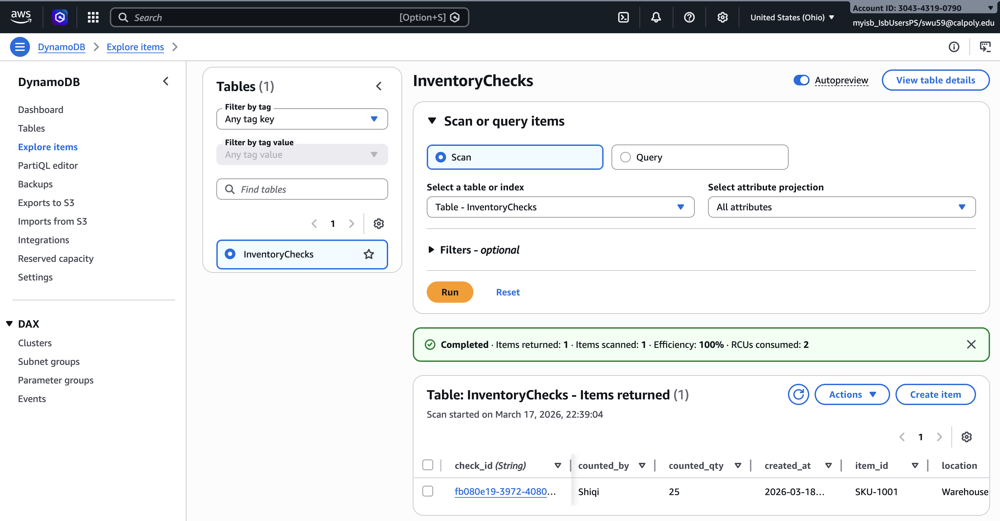
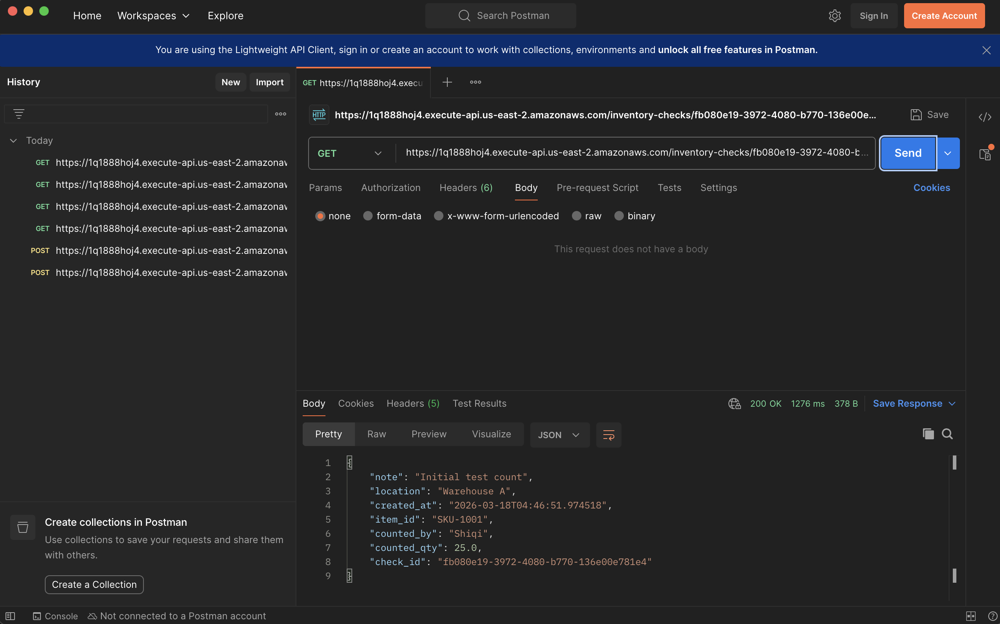

# inventory-checks-api

## Project Overview
This project is a simple serverless API for logging inventory checks (cycle counts) and retrieving them later by ID.

In many businesses, inventory checks are often tracked in spreadsheets, paper notes, or chat messages. This can lead to missing records, inconsistent formats, and difficulty finding past checks. This API provides a simple centralized way to store and retrieve inventory check records.

## Real Use Case
This project models an **inventory check log** for business operations.

A team member can create a new inventory check record with:
- item ID
- location
- counted quantity
- note
- counted by

Later, the same record can be retrieved by its unique `check_id`.

## Why It Matters to Business
This matters because a centralized inventory check log can help:
- reduce inventory discrepancies
- save time during audits and re-checks
- improve inventory visibility
- support better replenishment decisions

## AWS Services Used
This project uses 3 core AWS services:

1. **API Gateway**
   - provides the public API endpoint

2. **AWS Lambda**
   - runs the backend logic for POST and GET requests

3. **Amazon DynamoDB**
   - stores inventory check records in a table

## Additional AWS Service Used for Debugging
- **CloudWatch Logs**
  - used to view Lambda execution logs and troubleshoot errors

## API Endpoints

### 1. Create an inventory check
**POST** `/inventory-checks`

Example request body:
```json
{
  "item_id": "SKU-1001",
  "location": "Warehouse A",
  "counted_qty": 25,
  "note": "Initial test count",
  "counted_by": "Shiqi"
}

### 2. Retrieve an inventory check by ID
**GET** `/inventory-checks/{check_id}`

Example:
`GET /inventory-checks/fb080e19-3972-4080-b770-136e00e781e4`

## DynamoDB Table Design
**Table name:** `InventoryChecks`  
**Partition key:** `check_id` (String)

Example attributes:
- check_id
- item_id
- location
- counted_qty
- note
- counted_by
- created_at

## High-Level Flow
1. The client sends a request to API Gateway.
2. API Gateway invokes the Lambda function.
3. Lambda processes the request.
4. Lambda writes to or reads from DynamoDB.
5. The response is returned as JSON.

## Demo Summary
This project was tested successfully with Postman.

### POST test
A new inventory check record was created successfully.

### GET test
The same inventory check record was retrieved successfully by `check_id`.

## Demo Screenshots

### DynamoDB item stored successfully


### Postman GET request returned successfully


## Repository Contents
This repository includes:
- README.md
- Lambda function code
- project explanation and test flow

## Notes
No secrets, API keys, or credentials are included in this repository.
